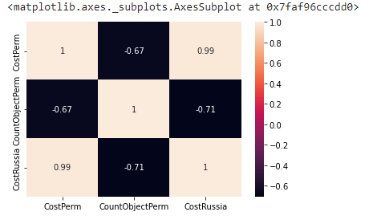
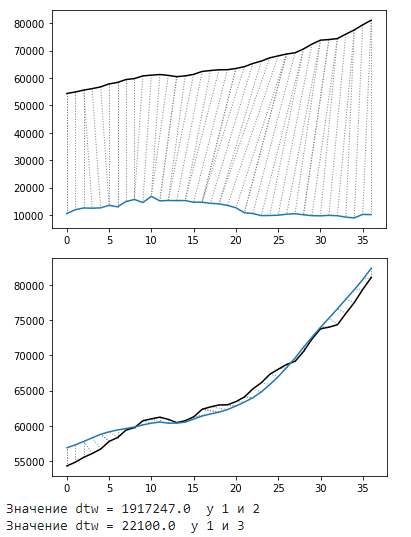

# Расчёт и оценка коэффициента корреляции и DTW
> Реализация алгоритма расчёта коэффициента корреляции и DTW расстояния между рядами.

> Вначале необходимо установить библиотеку DTW скриптом, представленным ниже. Поскольку сервис Google Colab работает под управлением Linux, то и все его команды применимы.
```Python
pip install dtw-python
```

> Чтобы скрипт правильно обработал данные необходимо вначале задать один настроечный параметр. В переменной **path_file** задаётся путь к CSV-файлу

> Структура файла CSV имеет следующую структуру:
 - В первом столбце указывается номер месяца по порядку
 - Со второго по четвёртый указываются значения рядов

> Результат выполнения с файлом *Data.csv*, расположенным в папке **Example** можно увидеть ниже:





> На тепловой карте имеются значения коэффициентов корреляции. Средний уровень корреляции наблюдается между столбцами CostPerm и CountObjectPerm. Высокий уровень корреляции у рядов CostPerm и CostRussia. При этом DTW-расстояния рядов могут быть оценены только способом сравнения их значений. Чем больше удаление рядов и разная их форма, то тем больше значение DTW.
